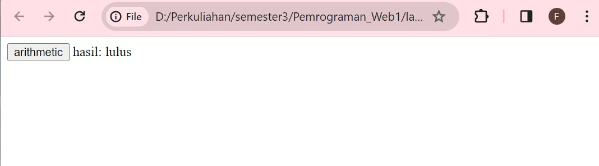
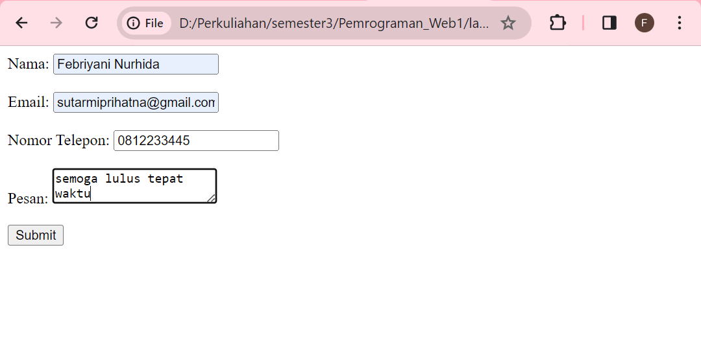

```
Febriyani Nurhida
312210222
TI.22.A2
```
# Praktikum 5: Javascript
## Instruksi Praktikum
1. Persiapkan text editor misalnya VSCode.
2. Buat folder baru dengan nama lab5_javascript.
3. Ikuti langkah-langkah praktikum yang akan dijelaskan berikutnya.
4. Lakukan validasi dokumen html dengan mengakses http://validator.w3.org
## Langkah-langkah Praktikum
Persiapan membuat dokumen HTML dengan nama file lab5_javascript.html seperti berikut.
```html
<!DOCTYPE html>
<html lang="en">
<head>
<title>Mengenal JavaScript</title>
</head>
<body>
<h1>Pengenalan JavaScript</h1>
<h3>Contoh document.write dan console.log</h3>
<script>
document.write("Hello World");
console.log("Hello World");
</script>
</body>
</html>
```


hasilnya :


## Javascrip Dasar
Pemakaian Alert sebagai property window.
```html
<html>
<head>
<title>alert box</title>
</head>
<body>
<script language="javascript">
<!--
window.alert("ini merupakan pesan untuk anda");
//-->
</script>
</body>
</html>
```

hasilnya:


Pemakaian method dalam objek

```html
<html>
<head>
<title>skrip javascript</title> </head>
<body>
percobaan memakai javascript:<br> <script language="javascript">
<!--
document.write("selamat mencoba javascript<br>"); document.write("semoga sukses!");
//-->
</script>
</body> 
</html>
```


hasilnya


Pemakaian Prompt

```html
<html>
<head>
<title>pemasukan data</title>
</head>
<body>
<script language="javascript">
<!--
var nama = prompt("siapa nama anda?","masukkan nama anda");
document.write("hai," + nama);
//-->
</script>
</body>
</html>
```


hasilnya:


ketika nama di input hasilnya:


Pembuatan fungsi dan cara pemanggilannya

```html
<html>
<head>
<title>contoh program javascript</title>
<script language="javascript">
function pesan(){ alert("memanggil javascript lewat body onload") }
</script>
</head>
<body onload=pesan ()>
+</body> |
-</html>
```


hasilnya :


## Dasar Pemrograman Di Javascript
Operasi dasar aritmatika
```html
<html>
<head> 
    <title>contoh program javascript</title>
<script language="javascript"> 
function test (vali, val2)
{
    document.write("<br>"+"perkalian: vall val2 "+"<br>")
    document.write(vall*val2)
    document.write("<br>"+"pembagian: vall/val2"+"<br>")
    document.write(val1/val2)
    document.write("<br>"+"penjumlahan : vall+val2 "+"<br>")
    document.write(vall+val2)
    document.write("<br>"+"pengurangan: vali-val2"+"<br>") 
    document.write(vall-val2)
    document.write("<br>"+"modulus: vallaval2"+"<br>")
    document.write(val1%val2)
}
    </script>
</head>
<body>
    <input type="button" name="button" value="arithmetic" onclick=test (9,4)> 
</body>
</html>
```


hasilnya:


saat di klik akan muncul seperti ini :


Seleksi kondisi (if..else)

```html
<html>
<head>
<title>contoh if-else</title>
</head>
<body>
<script language="javascript"> 
<!--
var nilai = prompt("nilai (0-100): ", 0);
var hasil = "";
if (nilai >= 60)
hasil "lulus";
else
hasil = "tidak lulus";
document.write("hasil: "+ hasil);
//-->
    </script>
</body>
</html>
```


hasilnya :


saat diinputkan angka hasilnya:




Penggunaan operator switch untuk seleksi kondisi

```html
<html> 
<head >
    <title>contoh program javascript</title>

    <script language="javascript">
    function test ()
    {
    vall-window.prompt("input nilai (1-5):") 
    switch (vall)
        {

        case "1":
            document.write("bilangan satu")
            break
        case "2" :
            document.write("bilangan dua")
             break 
        case "3" :
            document.write("bilangan tiga")
            break
         case "4":
            document.write("bilangan empat")
            break 
        case "5":
            document.write("bilangan lima")
            break 
        default:
            document.write("bilangan lainnya")
        }
    } 
    </script>
    </head>
    <body>
    <input type="button" name="button" value="switch" onclick=test()>
    </body>
    </html>
 ```


hasilnya:


saat diklik switch nya akan muncul :


lalu setelah diinputkan angka akan tampil:


## Pembuatan Form
Form Input

```html
<html>
<head>
    <script language="javascript">
    function test () {
        var vall-document.kirim.T1.value
    if (val1%2==0)
        document.kirim.T2.value="bilangan genap"
    else
        document.kirim.T2.value="bilangan ganjil"
    }
    </script>
</head>
<body>
    <form method="POST" name="kirim">
        <p>BIL <input type="text" name="T1" size="20">
        MERUPAKAN BIL <input type="text" name="12" size="20"></p>
        <p><input type="button" value="TEBAK" name="B1" onclick=test()></p>
    </form>
</body>
</html>
```


hasilnya:


bila diinput angka maka:


Form Button.

```html
<html> 
<head>
    <title>objek document</title>
</head>
<body>
    <script language = "javascript">
    <!--
    function ubahWarnaLB (warna) { 
        document.bgColor = warna; 
    }
        function ubahWarnaLD (warna) {  
        document.fgColor = warna;
    }
//-->
</script>

<h1>tes</h1>
<form>
    <input type="button" value="Latar Belakang Hijau" onclick="ubahWarnaLB('GREEN')">
    <input type="button" value="Latar Belakang Putih" onclick="ubahWarnaLB('WHITE')">
    <input type="button" value="Teks Kuning" onclick="ubahWarnaLD('YELLOW')"> 
    <input type="button" value="Teks Biru" onclick="ubahWarnaLD('BLUE')">
</form>
<script language = "javascript">

    document.write("Dimodifikasi terakhir pada " + 
    document.lastModified);

    </script>
</body>
</html>
```


hasilnya :


saat di klik latar belakang hijau hasilnya:


saat diklik latar belakang putih hasilnya :


saat diklik teks kuning hasilnya :


saat diklik teks biru hsilnya:


## HTML DOM
Pilihan menggunakan checkBox dengan perhitungan otomatis

```html
<html>
<head>
<title>Daftar Menu</title>
<script> 
function hitung(ele) {
    var total = document.getElementById('total').value; 
        total = (total ? parseInt(total) : 0);
    var harga = 0;

if (ele.checked) {
    harga = ele.value; 
    total += parseInt(harga); 
   
} else {
     harga = ele.value; 
    if (total > 0) 
        total -= parseInt(harga);
}

document.getElementById('total').value = total;
}

</script>
</head>
<body>
<h1>Daftar Menu Makanan</h1>
<label><input type="checkbox" value="5000" id="menu1" onclick="hitung (this);" /> Ayam Goreng Rp. 5.000</label><br />
<label><input type="checkbox" value="500" id="menu2" onclick="hitung(this);"/> Tempe Goreng Rp. 500</label><br /> 
<label><input type="checkbox" value ="2500" id="menu3" onclick="hitung(this);" /> Telur Dadar Rp. 2.500</label><hr />
<strong>Total Bayar: Rp. <input id="total" type="text" /></strong>
</body> 
</html>
```


hasilnya :


kalau di pilih menunya maka:


## Pertanyaan dan Tugas
1. Buat script untuk melakukan validasi pada isian form.

jawab :

Berikut adalah contoh script JavaScript yang melakukan validasi lebih lengkap pada isian formulir, termasuk validasi untuk nama, email, nomor telepon, dan pesan:

```html
<!DOCTYPE html>
<html>
<head>
    <title>Validasi Form</title>
    <script>
        function validateForm() {
            var nama = document.forms["myForm"]["nama"].value;
            var email = document.forms["myForm"]["email"].value;
            var telepon = document.forms["myForm"]["telepon"].value;
            var pesan = document.forms["myForm"]["pesan"].value;

            // Validasi nama
            if (nama == "") {
                alert("Nama harus diisi");
                return false;
            }

            // Validasi email
            var emailPattern = /^[a-zA-Z0-9._%+-]+@[a-zA-Z0-9.-]+\.[a-zA-Z]{2,}$/;
            if (!email.match(emailPattern)) {
                alert("Email tidak valid");
                return false;
            }

            // Validasi nomor telepon
            var teleponPattern = /^\d{10}$/;
            if (!telepon.match(teleponPattern)) {
                alert("Nomor telepon harus terdiri dari 10 digit angka");
                return false;
            }

            // Validasi pesan
            if (pesan == "") {
                alert("Pesan harus diisi");
                return false;
            }

            // Jika semua validasi berhasil
            alert("Formulir telah diisi dengan benar!");
            return true;
        }
    </script>
</head>
<body>
    <form name="myForm" onsubmit="return validateForm()" method="post">
        <label for="nama">Nama:</label>
        <input type="text" name="nama"><br><br>

        <label for="email">Email:</label>
        <input type="text" name="email"><br><br>

        <label for="telepon">Nomor Telepon:</label>
        <input type="text" name="telepon"><br><br>

        <label for="pesan">Pesan:</label>
        <textarea name="pesan"></textarea><br><br>

        <input type="submit" value="Submit">
    </form>
</body>
</html>

```

Dalam contoh di atas, kami menambahkan validasi yang rinci untuk nama (harus diisi), email (menggunakan regular expression untuk memeriksa format email), nomor telepon (harus terdiri dari 10 digit angka), dan pesan (harus diisi). Anda dapat menyesuaikan dan memodifikasi validasi sesuai dengan kebutuhan Anda.


ini adalah tampilan awalnya:


jika kita mengkosongkan formulir maka akan muncul :


jika kita tidak benar dalam mengisi data maka akan muncul :


jika kita mengosongkan salah satu kotak validasi maka akan muncul:


ini contoh mengisi dengan benar :





maka akan muncul :


### sekian dan terima kasih :)